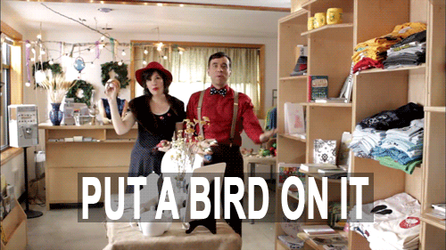

# :robot: put-a-bot-on-it

Silly bot for a private discord server I run

## Requirments

- Node.js >= 17.x
- npm >= 8.x

### Local Development

1. Clone repo `git clone https://github.com/mikesprague/put-a-bot-on-it.git`
1. Enter directory `cd put-a-bot-on-it`
1. Install dependencies `npm install`
1. Set up environment variables:
   - `DISCORD_BOT_TOKEN`
   - `DISCORD_CLIENT_ID`
   - `DISCORD_GUILD_ID`
   - `GIPHY_API_KEY`
   - `TENOR_API_KEY`
   - `NASA_API_KEY`
1. Run locally `npm run dev`

### Uses (incomplete list)

- [discord.js Library](https://github.com/discordjs/discord.js)
- [Tenor API](https://tenor.com/gifapi)
- [Giphy API](https://developers.giphy.com/)
- [NASA API (Astronomy Picture of the Day)](https://api.nasa.gov/)
- [icanhazdadjoke.com API](https://icanhazdadjoke.com)
- [package.place API](https://package.place)
- [kanye.rest API](https://kanye.rest/)
- ...
